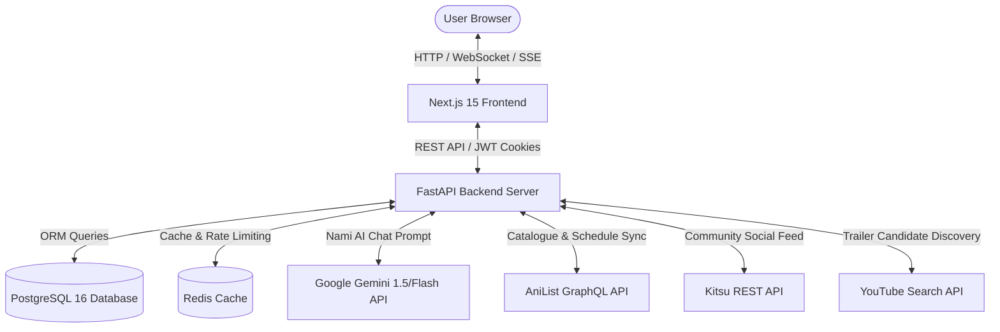

# 🌌 AniVerse — Next-Gen AI Anime Discovery, Official Media & Watchlist Platform

<p align="center">
  
  
  
  
  
  
</p>

---

## 🌟 Executive Overview

**AniVerse** is a full-stack, enterprise-grade web application built for anime enthusiasts to discover, track, watch verified trailers, and engage in spoiler-controlled community discussions. 

Built on a modern monorepo architecture featuring **Next.js 15 (Turbopack)** and a high-performance **FastAPI (Python 3.13)** backend, AniVerse offers an unmatched user experience powered by **Google Gemini AI**, **Server-Sent Events (SSE) real-time streaming**, an automated **YouTube video curation pipeline**, and a multi-tiered **community social feed**.

---

## ✨ Key Features & Capability Spotlight

### 🤖 1. Nami AI Chatbot (Google Gemini Powered)
- **Straw Hat Navigator Persona**: Nami answers any question about anime recommendations, character trivia, plot breakdowns, or One Piece lore in her authentic witty tone.
- **Dynamic AI Engine**: Powered by Google Gemini (`gemini-flash-latest` / `gemini-2.0-flash`) with fallback safety.
- **Interactive Database Media Cards**: When Nami recommends anime, her responses automatically attach clickable AniVerse media cards (complete with cover art, rating scores, genres, and direct page links).
- **Clear Chat & Bottom-Right Widget**: Glassmorphism UI anchored to the bottom-right corner with single-click chat clearing and official high-resolution Nami avatar artwork.

### ⚡ 2. Real-Time Streaming AniList Watchlist Import
- **Server-Sent Events (SSE) Progress Modal**: Real-time import process displaying total entry count, percentage progress bar, active title card preview, and scrolling live activity logs.
- **Score Normalization (100-Point Scale Handling)**: Handles AniList `POINT_100`, `POINT_10_DECIMAL`, and custom ratings, safely fitting PostgreSQL `NUMERIC(5,2)` constraints.
- **Custom List Matching**: Resolves custom AniList names (e.g. *"Dropped Shows"*) and entry-level list statuses.

### 🗓️ 3. Airing Schedule & Interactive Calendar
- **Airing Schedule View**: Weekly calendar grid with release countdown timers, episode numbers, airing status badges, and timezone calculations.
- **Multi-View Modes**: Switch between **Airing Schedule**, **List View**, and **My Calendar**.

### 📽️ 4. Official Video & Trailer Curation Pipeline
- **Automated Discovery Crawling**: Background rules engine scores YouTube trailers, PVs, openings, and endings based on title relevance, official channel verification, and keyword heuristics.
- **Curator Moderation Queue**: High-confidence candidates (80%+) are auto-published, while borderline candidates are queued in the `/admin` curation portal.
- **Custom IFrame Player**: Embeds official media in a dark glassmorphism video player modal.

### 🔍 5. Advanced Catalogue & Multi-Filter Search
- **Comprehensive Catalogue Filters**: Multi-select filter panel by genre, season, format (TV, Movie, OVA), score range, and sorting rules (Popularity, Score, Trending, Title).
- **Universal Resolver**: Handles searches by local ID, AniList ID, hyphenated slug-ID strings, or raw title slugs with automatic on-demand AniList backfilling.

### 📊 6. Watchlist & Progress Management
- **List Status Categories**: Track shows across `Watching`, `Completed`, `Planning`, `Paused`, `Dropped`, and `Rewatching`.
- **Incremental Episode Counter**: Single-click `+1` progress tracking with score sliders and favorite pinning.
- **Public & Private List Controls**: Configure visibility settings per user profile.

### 💬 7. Multi-Tier Community Social Layer
- **Multi-Tier Social Feed**: Fetches real-time community posts from Kitsu API, falls back to AniList GraphQL `TextActivity` feeds, and provides curated anime discussions.
- **Spoiler-Controlled Reviews**: User writeups with 1-100 scoring, spoiler blur tags, nested comment trees, and emoji reactions.

---

## 🏗️ System Architecture & Data Flow



---

## 🛠️ Technology Stack

| Layer | Technologies & Tools |
| :--- | :--- |
| **Frontend Framework** | **Next.js 15** (Turbopack, App Router) + **React 19** + **TypeScript** |
| **Styling & Design** | **Tailwind CSS** + Vanilla CSS Design System + Dark Glassmorphism Aesthetics |
| **Backend Framework** | **FastAPI (Python 3.13)** + **Uvicorn** (ASGI server) + **Pydantic v2** |
| **Databases & Cache** | **PostgreSQL 16** (Primary DB) + **Redis 7** (Query caching & Rate limit sliding window) |
| **ORM & Migrations** | **SQLAlchemy 2.0** + **Alembic** |
| **AI Chatbot Engine** | **Google Gemini 1.5 / 2.0 Flash API** (`gemini-flash-latest`) |
| **Real-Time Streaming** | **Server-Sent Events (SSE)** (`ssev2` streaming protocol) |
| **External APIs** | **AniList GraphQL v2 API** + **Kitsu JSON API** + **YouTube IFrame API** |
| **Authentication** | **JWT HttpOnly Cookie Security** + bcrypt password hashing |

---

## 📂 Repository Directory Structure

```text
AniVerse/
├── apps/
│   ├── web/                           # Next.js 15 Frontend Application
│   │   ├── app/
│   │   │   ├── (auth)/                # Login & Registration pages
│   │   │   ├── (user)/                # Watchlist, Favourites & AniList Sync
│   │   │   ├── admin/                 # Video Curator & Moderation Portal
│   │   │   ├── anime/[slug]/          # Detailed Anime View (Synopsis, Characters, Media)
│   │   │   ├── calendar/              # Airing Schedule Calendar
│   │   │   ├── discover/              # Multi-Filter Catalogue Search
│   │   │   ├── settings/              # User Profile & Visibility Settings
│   │   │   ├── upcoming/              # Upcoming Season Catalogue
│   │   │   └── videos/                # Official Video & Social Feed Hub
│   │   ├── components/
│   │   │   ├── community/             # Discussion & Review Sections
│   │   │   └── layout/                # Header, CookieBanner, NamiChatWidget
│   │   └── lib/                       # Auth wrappers & API helpers
│   │
│   └── api/                           # FastAPI Python Backend Application
│       ├── app/
│       │   ├── admin/                 # Curator queue endpoints
│       │   ├── anime/                 # Anime detail, search & character routers
│       │   ├── auth/                  # JWT security & session dependencies
│       │   ├── chat/                  # Nami AI Chatbot router (Google Gemini)
│       │   ├── community/             # Reviews, discussions & comment threads
│       │   ├── ingestion/             # AniList GraphQL sync & SSE import service
│       │   ├── lists/                 # Watchlist CRUD & stats
│       │   ├── media/                 # YouTube trailer candidate discovery engine
│       │   ├── notifications/         # Real-time alert notifications
│       │   ├── recommendations/       # Hybrid recommendation algorithms
│       │   ├── shared/                # Security middleware & rate limiters
│       │   ├── config.py              # Pydantic Settings configuration
│       │   └── main.py                # FastAPI entry point
│       └── requirements.txt           # Python dependencies
│
└── docker-compose.yml                 # PostgreSQL & Redis container config
```

---

## ⚙️ Local Development Setup

### 1. Prerequisites
Ensure you have the following installed:
- **Node.js (v18+)**
- **Python (v3.13+)**
- **Docker Desktop**

---

### 2. Launch Database & Cache Containers
Start PostgreSQL and Redis:
```bash
docker-compose up -d
```

---

### 3. Backend (FastAPI) Setup
Navigate to `apps/api`, create python virtual environment, install requirements, and run server:
```bash
cd apps/api
python3 -m venv .venv
source .venv/bin/activate
pip install -r requirements.txt

# Create .env file and add your Gemini API key (optional for AI Chatbot)
echo "GEMINI_API_KEY=YOUR_GEMINI_API_KEY_HERE" >> .env

# Launch Uvicorn Server with hot-reload
python -m uvicorn app.main:app --host 127.0.0.1 --port 8000 --reload
```
Interactive Swagger Docs will be available at [http://127.0.0.1:8000/api/v1/docs](http://127.0.0.1:8000/api/v1/docs).

---

### 4. Frontend (Next.js) Setup
Navigate to `apps/web`, install dependencies, and launch dev server:
```bash
cd apps/web
npm install
npm run dev
```
Open browser and navigate to [http://localhost:3000](http://localhost:3000).

---

## 🌐 API Endpoint Highlights

| Route Prefix | Method | Description |
| :--- | :---: | :--- |
| `/api/v1/anime` | `GET` | Filter, search, and list anime with genre/season options |
| `/api/v1/anime/{id}` | `GET` | Get detailed anime metadata, characters, and relations |
| `/api/v1/chat/nami` | `POST` | Talk with **Nami AI Chatbot** (Gemini AI + DB Cards) |
| `/api/v1/lists/sync/anilist/stream` | `GET` | Real-time SSE streaming AniList watchlist import |
| `/api/v1/lists` | `GET/POST` | User watchlist CRUD operations & stats |
| `/api/v1/media/social-feed` | `GET` | Multi-tier community social feed (Kitsu + AniList + Curated) |
| `/api/v1/community/reviews` | `GET/POST` | Fetch and post spoiler-blur anime reviews |

---

## 📜 License & Acknowledgements

Distributed under the **MIT License**. Data provided by **AniList GraphQL API**, **Kitsu REST API**, and **YouTube IFrame API**.
